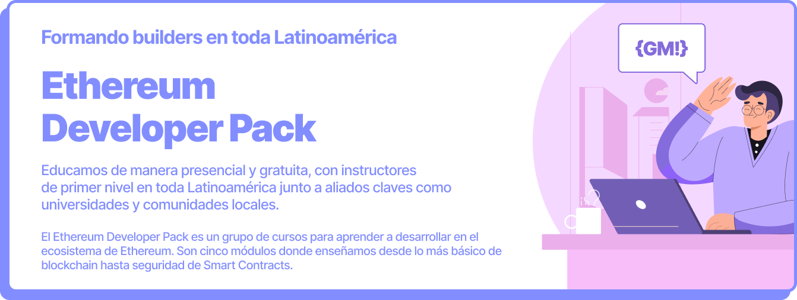

# Ethereum Developer Pack

Un grupo de cursos para aprender a desarrollar en el ecosistema de Ethereum. Son cinco módulos donde enseñamos desde lo más básico de blockchain hasta seguridad de Smart Contracts.

<figure><figcaption></figcaption></figure>
