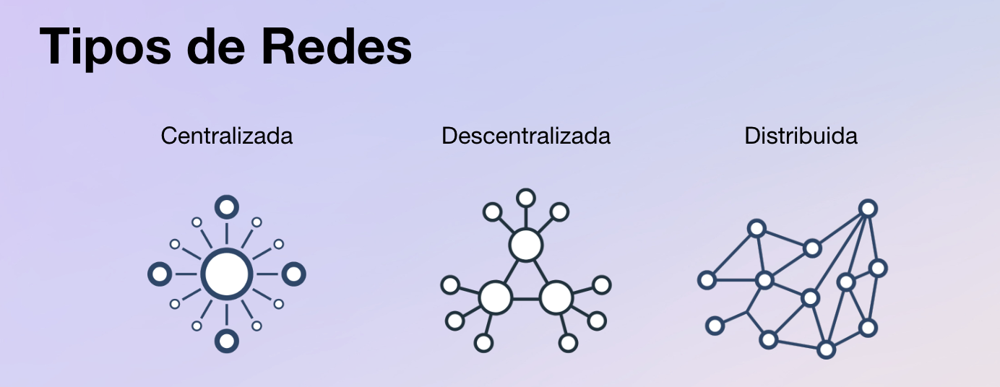

# Conceptos incorporados dentro de Blockchain

La genialidad de Satoshi Nakamoto se refleja en que supo integrar en su propuesta avances realizados en materias como: redes de computadores, teoría de juegos y criptografía.

Revisemos cada uno de estos conceptos.

### Redes de computadoras

Las redes se refieren a la forma en que los nodos se organizan para validar y mantener la integridad de la red. Las redes pueden ser centralizadas, descentralizadas o distribuidas, según cómo se administren y quién tenga el control de la red.

<figure><figcaption></figcaption></figure>

#### Centralizada

Arquitectura en la que todos los nodos de la red se conectan a un servidor central que tiene el control y la capacidad de tomar decisiones para la red. Esto significa que la red no es descentralizada y la toma de decisiones y el control de la red están en manos de una sola entidad central.

| Ventajas                       | Desventajas                                         |
| ------------------------------ | --------------------------------------------------- |
| Implementación simple y rápida | El servidor centralizado es un punto único de fallo |
| Fácil mantenimiento y control  | Falta de transparencia y control centralizado       |

#### Descentralizada

Es una arquitectura en la que los nodos están distribuidos en múltiples ubicaciones y no están controlados por una única entidad central. En lugar de eso, cada nodo tiene una copia completa de la base de datos de la cadena de bloques y los usuarios de la red tienen cierto grado de control y toma de decisiones

| Ventajas                         | Desventajas                             |
| -------------------------------- | --------------------------------------- |
| Mayor privacidad y transparencia | Altos costes de gestión y mantenimiento |
| Mayor seguridad\*                | Menor control y eficiencia\*            |

#### Distribuida

Una red distribuida de blockchain es una red descentralizada de nodos interconectados que mantienen una copia idéntica del libro mayor compartido y trabajan juntos para validar transacciones y garantizar la integridad de la red. Esto proporciona una mayor transparencia, seguridad y resistencia a la censura en comparación con los sistemas centralizados.

| Ventajas                    | Desventajas                             |
| --------------------------- | --------------------------------------- |
| Tolerancia extrema a fallas | Altos costes de gestión y mantenimiento |
| Transparencia mejorada      | Lenta coordinación entre nodos          |

### Teoría de Juegos

La teoría de juegos es la rama de las matemáticas que estudia la elección óptima para un individuo cuando sus resultados dependen de lo que hagan a su vez otros individuos.

La teoría de juegos se aplica en diferentes aspectos del diseño de una blockchain para hacer que los participantes (mineros o validadores) se comporten de una forma que no ponga en riesgo la integridad, continuidad y seguridad de la red.

Así, podemos ver la aplicación de la teoría de juegos en los siguientes aspectos:

#### Protocolos de Consenso

La teoría de juegos puede utilizarse para modelar y analizar los comportamientos estratégicos de los nodos en un protocolo de consenso, como en el caso de Proof of Work (PoW) y Proof of Stake (PoS). Estos protocolos garantizan que todos los nodos de la red estén de acuerdo en el estado actual de la blockchain. Esto evita la posibilidad de que se introduzcan bloques fraudulentos o transacciones no válidas en la cadena.

#### Incentivos

Diseñar sistemas de incentivos efectivos es crucial para alinear los intereses de los participantes en una red blockchain. La teoría de juegos puede ayudar a modelar cómo los actores racionales responden a diferentes incentivos y cómo se pueden ajustar los mecanismos de consenso para lograr un comportamiento deseado.

Por ejemplo, en PoS, los nodos con más activos tienen más probabilidades de ser seleccionados para validar bloques, lo que proporciona un incentivo para actuar de manera honesta.

#### Seguridad y Ataques

La teoría de juegos se aplicar para analizar posibles ataques y estrategias defensivas en el contexto de blockchain. Por ejemplo, modelar cómo un atacante puede intentar realizar un doble gasto en una red blockchain y cómo los mecanismos de consenso pueden prevenir o mitigar tales ataques.

Los mecanismos de consenso ayudan a proteger la red contra varios tipos de ataques, como ataques del 51% en PoW, donde un actor malintencionado controla más de la mitad del poder computacional de la red. Al implementar un mecanismo de consenso robusto, se dificulta la realización de ataques maliciosos.

Un concepto que es común a la teoría de juegos y a la ciencia de la computación es el [Problema de los Generales Bizantinos](https://www.microsoft.com/en-us/research/uploads/prod/2016/12/The-Byzantine-Generals-Problem.pdf). En este problema se plantea la cuestión de cómo los componentes de un sistema distribuido pueden llegar a un consenso cuando algunos de esos componentes pueden comportarse de manera maliciosa o, más generalmente, cuando pueden ocurrir fallas y los nodos deben tomar decisiones en conjunto. La analogía se basa en un escenario hipotético en el que los generales de un ejército bizantino deben coordinar sus acciones para atacar o retirarse, pero algunos de los generales pueden ser traidores y dar órdenes falsas.

Este problema es fundamental para entender los desafíos de coordinar sistemas distribuidos en presencia de fallas y comportamientos maliciosos, y ha llevado al desarrollo de conceptos y algoritmos en la teoría de la computación distribuida, como el algoritmo del consenso de Byzantine Fault Tolerance (BFT). Estos conceptos son esenciales en la construcción y mantenimiento de sistemas descentralizados, como la blockchain.

En el caso particular de Bitcoin, la forma de resolver el problema de ataques o fallas en la conexión es a través del consenso de Proof of Work, que proporciona un mecanismo de consenso descentralizado, seguro y resistente a la censura. La combinación de incentivos económicos, esfuerzo computacional y descentralización contribuye a la robustez y seguridad de la red.

### Criptografía

La criptografía es esencial en la blockchain para garantizar la seguridad y la privacidad de las transacciones. En la blockchain, cada transacción se registra en un bloque, que se agrega a una cadena de bloques. Cada bloque contiene un hash, que es una cadena de caracteres única que identifica el bloque y todas las transacciones que contiene.

**Qué es un hash**

Un hash (picadillo en español) es un código que se obtiene al aplicar una función criptográfica a una información de entrada. Podríamos por ejemplo aplicar una función hash a un documento, un video, una imagen o un programa y obtendremos como resultado un código único y de un tamaño fijo, un hash, equivalente a una huella digital del archivo de origen.

<figure><figcaption></figcaption></figure>

Si alguien alterase de forma accidental o fraudulenta el archivo de origen, el hash cambiaría totalmente y podríamos detectar de esa manera que el archivo original ha sido modificado.

Para un archivo digital podemos generar un hash a través de una función criptográfica, pero no podemos reconstruir el documento original a partir del hash (es unidireccional).

Para generar hashes se utilizan diversas funciones, según el nivel de fortaleza de encriptación que se desee lograr. En el caso del protocolo de Bitcoin una de las funciones hash utilizadas es la SHA-256 (SHA es Secure Hash Algorithm) y da como resultado un código de 64 caracteres hexadecimales (256 bits).

El sistema de numeración hexadecimal tiene 16 símbolos. Su equivalencia en en sistema de numeración decimal se muestra a continuación.

Decimal 0 1 2 3 4 5 6 7 8 9 10 11 12 13 14 15&#x20;

Hex. 0 1 2 3 4 5 6 7 8 9 A B C D E F

**Requisitos de una función hash**
