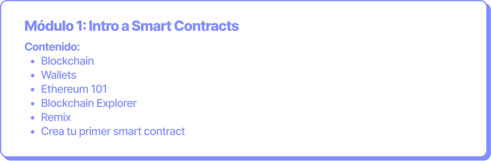

# Intro a Smart Contracts

**Objetivo:** Revisar los conceptos básicos de blockchain y Ethereum para entender la máquina descentralizada sobre la corren los smart contracts. Crear el primer smart contract en una testnet.

**Duración:** 6 horas (2 clases de 3 horas cada una).

<figure><figcaption></figcaption></figure>


Este documento es una herramienta pedagógica que actualizamos constantemente. Creemos en la importancia de contenidos open-source. Si quieres mejorar los contenidos, únete a nuestro programa de [Kipu Explorers](../../contribuye/kipu-explorer.md).

