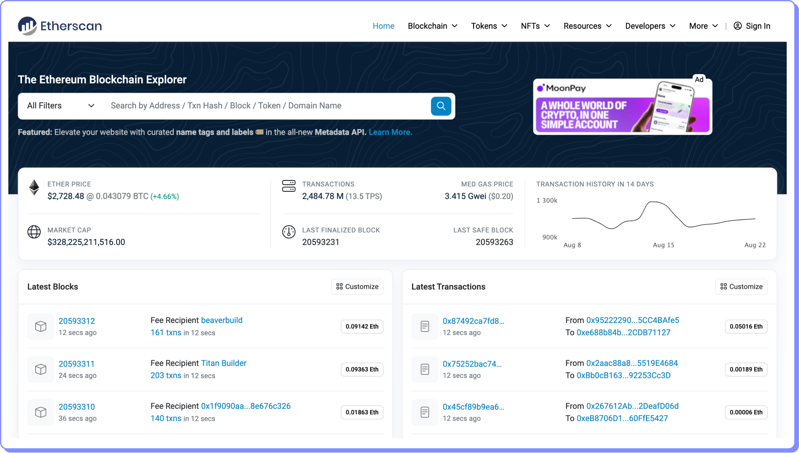

# Blockchain Explorer

Un blockchain explorer es una herramienta que permite a los usuarios explorar una cadena de bloques. Los blockchain explorers pueden proporcionar información sobre la blockchain, como los bloques, las transacciones, las direcciones y los contratos inteligentes.

Los blockchain explorers funcionan recopilando datos de la blockchain. Los datos se recopilan utilizando una variedad de métodos, como el rastreo de los nodos de la cadena de bloques o el uso de APIs proporcionadas por los desarrolladores de las blockchains.

Una vez que los datos se han recopilado, se almacenan en una base de datos. Los usuarios pueden acceder a los datos de la base de datos utilizando una interfaz de usuario proporcionada por el blockchain explorer.

Uno de los blockchain explorers más usados es [Etherscan](https://etherscan.io/).

<figure><figcaption></figcaption></figure>
