# Crea tu primer Smart Contract

En esta parte final de este primer módulo vamos a crear un contrato inteligente y desplegarlo en una red de prueba (testnet) de Ethereum, como Sepolia.

El contrato que desplegaremos es Register01.sol:

```solidity
// SPDX-License-Identifier: GPL-3.0
pragma solidity 0.8.22;

contract Register01 {
    string private storedInfo;

    function setInfo(string memory myInfo) external {
        storedInfo = myInfo;
    }

    function getInfo() external view returns (string memory) {
        return storedInfo;
    }
}
```

Veamos lo que hace Register01.sol:

Este contrato simple permite almacenar y recuperar información de texto. La función setInfo se utiliza para modificar la información almacenada, mientras que la función getInfo se utiliza para consultar la información actual sin realizar cambios en el estado del contrato.

* Versión del Compilador Solidity Utilizada: 0.8.22. En Solidity se utiliza la keyword **pragma** para declarar la versión de compilador que se debe utilizar para ejecutar el contrato.
* Licencia: GPL-3.0
* Variables de Estado:
  * **storedInfo**: Variable privada que almacena información de tipo string (texto).
* Funciones:
  * **setInfo** (Función de Transacción Externa): Actualiza el valor de storedInfo con la información proporcionada como argumento.
    * Parámetros: myInfo, el texto a cargar en storedInfo.
  * **getInfo** (Función de Consulta Externa): Devuelve el valor actual de storedInfo sin modificar el estado del contrato.
    * Parámetros: Ninguno

Llevemos el código del contrato a Remix.

<figure>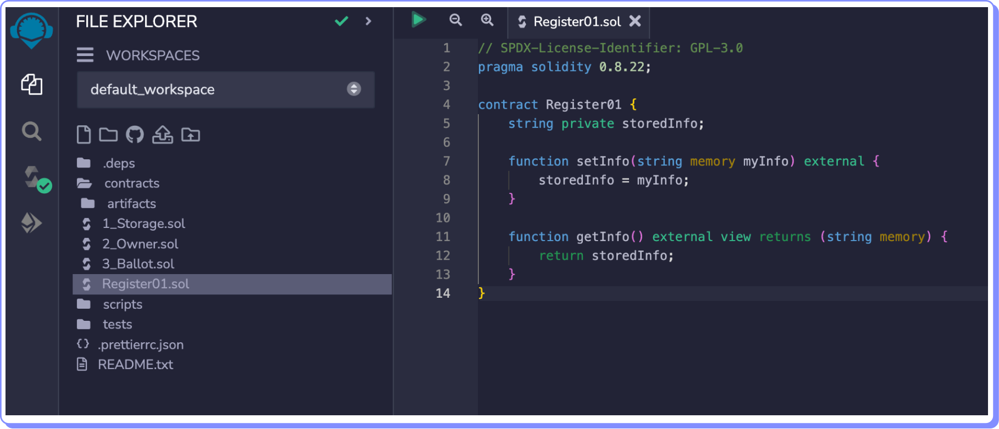<figcaption></figcaption></figure>

El check verde al lado del ícono del compilador nos indica que se compiló correctamente. Podemos proceder a desplegarlo.

<figure>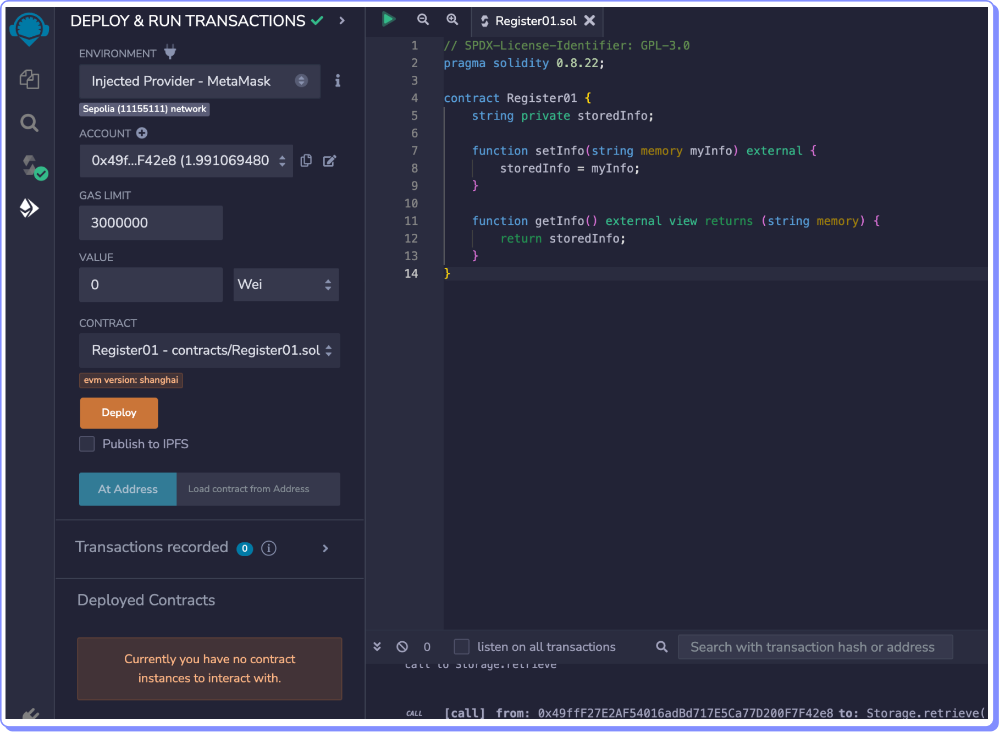<figcaption></figcaption></figure>

Debemos asegurarnos de:

* Tener nuestra wallet conectada a Sepolia,
* Haber seleccionado en Environment la opción Injected Provider-Metamask,
* Tener suficiente ETH en Sepolia y
* Verificar que el contrato a desplegar es el correcto.

Ahora sí procedamos a desplegar.

<figure>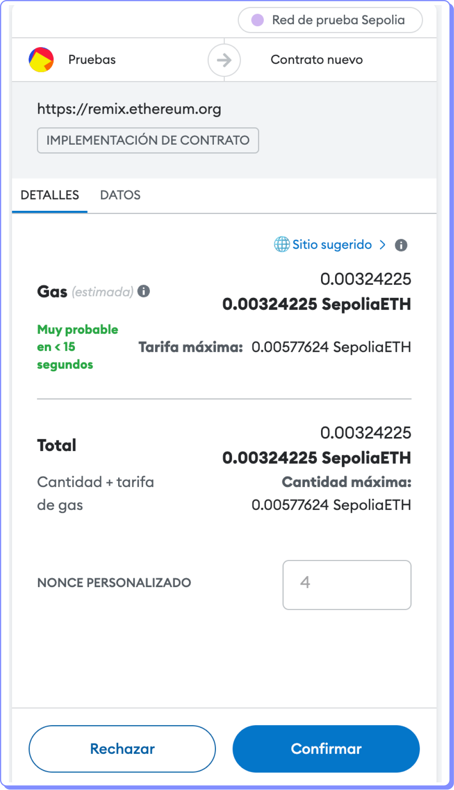<figcaption></figcaption></figure>

Aprobemos la transacción en nuestra wallet.

<figure>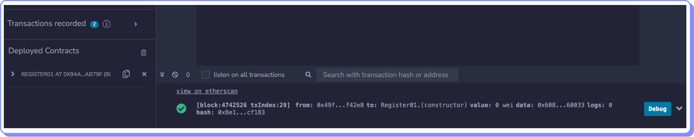<figcaption></figcaption></figure>

El contrato ha sido desplegado y se le ha asignado una cuenta de contrato (contract account) en Sepolia. Haciendo clic en el ícono de copiar del gráfico anterior podemos obtener esta cuenta.

<figure>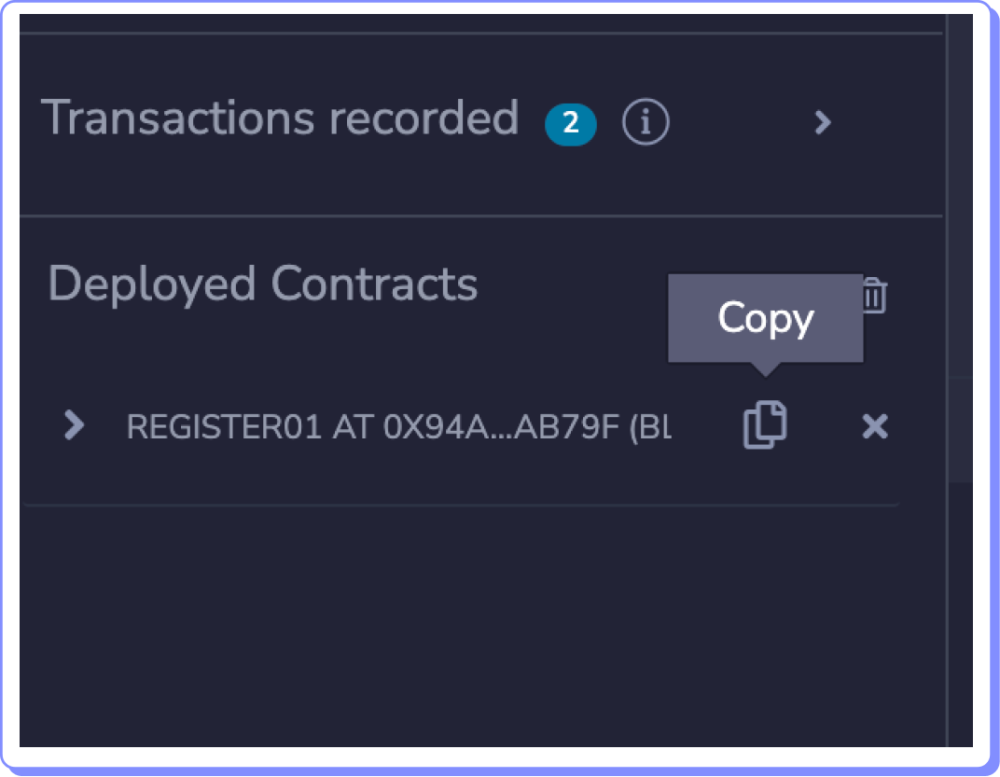<figcaption></figcaption></figure>

En el ejemplo es: 0x94A6985da19A3eA8A1182FA24791069365CAB79f

Vayamos al [explorador de bloques de Sepolia](https://sepolia.etherscan.io/) para comprobarlo.

Ingresamos la cuenta en el campo de búsqueda de Sepolia

<figure>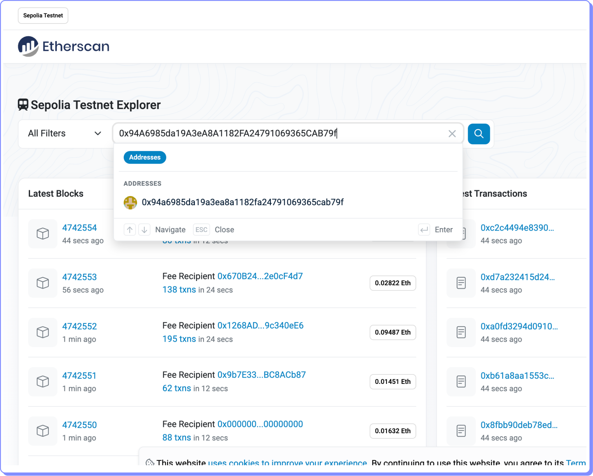<figcaption></figcaption></figure>

Podemos confimar que se ha creado una cuenta de contrato desde nuestra EOA en Sepolia.

<figure>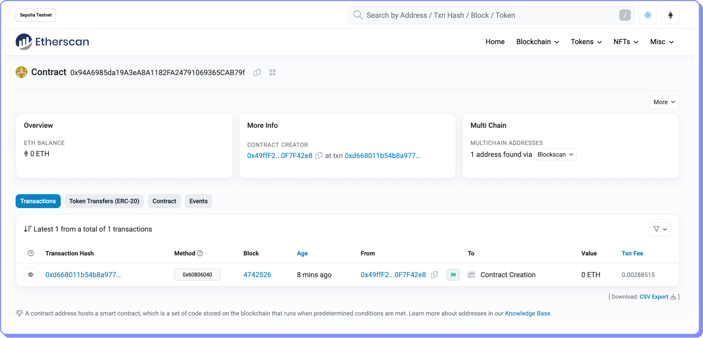<figcaption></figcaption></figure>

Si vamos a la pestaña Contract podemos visualizar el bytecode que se ha desplegado en esta cuenta de contrato

<figure>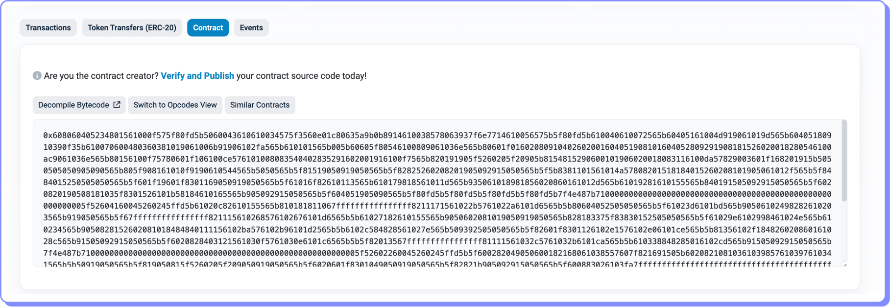<figcaption></figcaption></figure>

¿Cómo podemos comprobar que corresponde al código de Register01.sol?

Debemos Verificarlo y Publicarlo. Para ello hacemos clic sobre la frase en azul “Verify and Publish”.

Nos aparecerá la pantalla siguiente en la que debemos completar la dirección del contrato, el tipo de compilador utilizado, la versión de compilador y el tipo de licencia Open Source. Luego hacemos clic en Continuar.

<figure><figcaption></figcaption></figure>

En la siguiente pantalla debemos copiar el código Solidity de Register01.sol

<figure>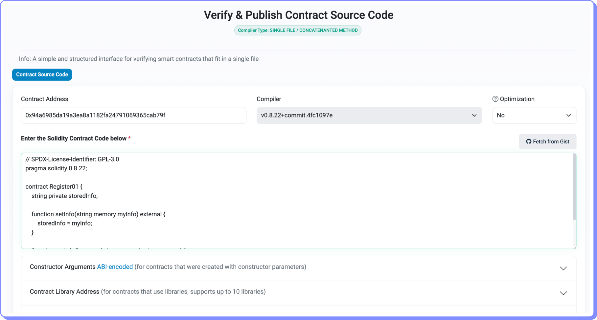<figcaption></figcaption></figure>

Completamos el captcha y hacemos clic en Verify and Publish.

<figure>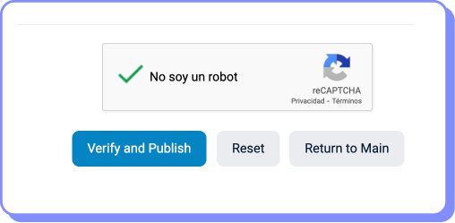<figcaption></figcaption></figure>

<figure>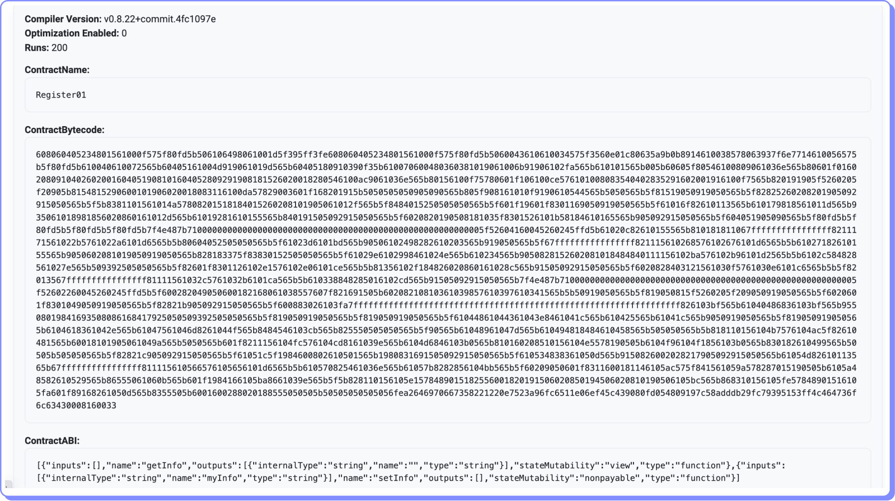<figcaption></figcaption></figure>

Si la correspondencia es correcta, nos aparecerá una pantalla como la siguiente donde ahora también podremos ver la ABI.

Si regresamos a la cuenta del contrato en Etherscan veremos que ahora hay información adicional.

<figure>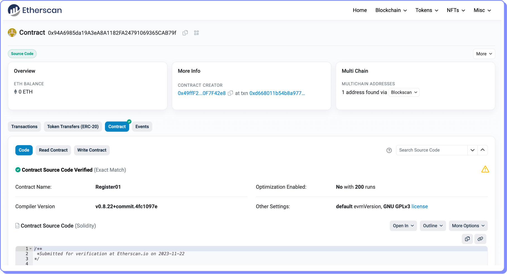<figcaption></figcaption></figure>

Junto al botón azul del contrato ahora hay un check verde, que indica que el contrato ha sido verificado. El código del contrato ahora también aparece junto al bytecode y el ABI.

Pero también aparecen botones para interactuar con el contrato: Read Contract (para funciones de lectura) y Write Contract (para escritura/modificación).

Podemos interactuar entonces con nuestro contrato inteligente desde el explorador de bloques.

Por ejemplo, si quisiéramos grabar en la variable storedInfo la frase “Hello World”, tendríamos que hacer clic sobre el botón Write Contract.

<figure>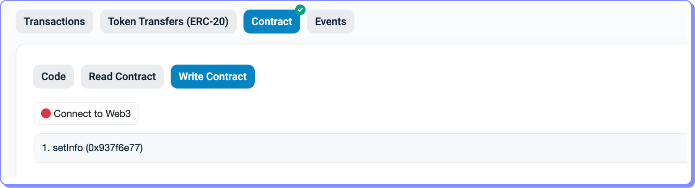<figcaption></figcaption></figure>

Vemos que setInfo es la única función de escritura. Para utilizarla primero debemos conectar nuestra wallet a Etherscan. Para ello, hacer clic en Connect to Web3.

<figure><figcaption></figcaption></figure>

Una vez conectada nuestra wallet, nos aparece el campo para ingresar el texto a grabar. Lo ingresamos y hacemos clic sobre Write.

Al ser una transacción de escritura, debemos aprobar la transacción y pagar el gas correspondiente.

<figure>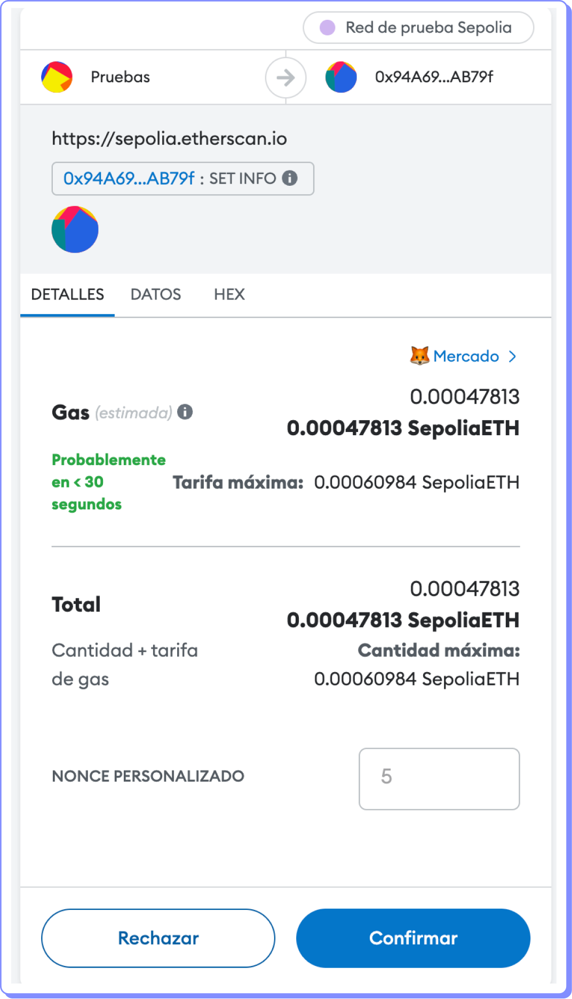<figcaption></figcaption></figure>

Para verificar si la transacción ha sido exitosa podemos ir a Read Contract y visualizar el contenido de la variable storedInfo utilizado la función de lectura getInfo.

<figure>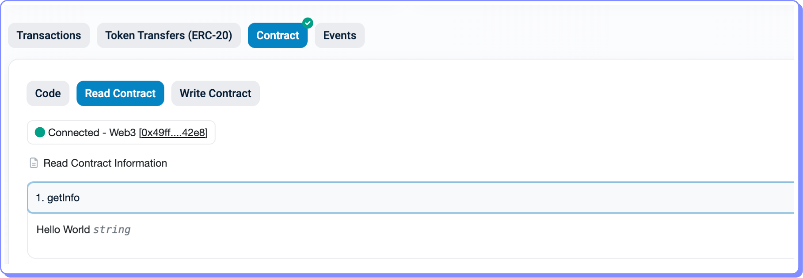<figcaption></figcaption></figure>

getInfo nos muestra que el contenido es “Hello World”.

Recapitulando has seguido los siguientes pasos:

1. Creaste un contrato
2. Lo compilaste
3. Lo desplegaste en una blockchain pública, en este caso Sepolia.
4. Lo validaste y publicaste utilizando un explorador de bloques. De forma que una persona interesada en tu contrato pueda entender qué hace.
5. Interactuaste con el contrato utilizando el explorador de bloques.

### **¡Felicitaciones has culminado la Intro a Smart Contracts!**
