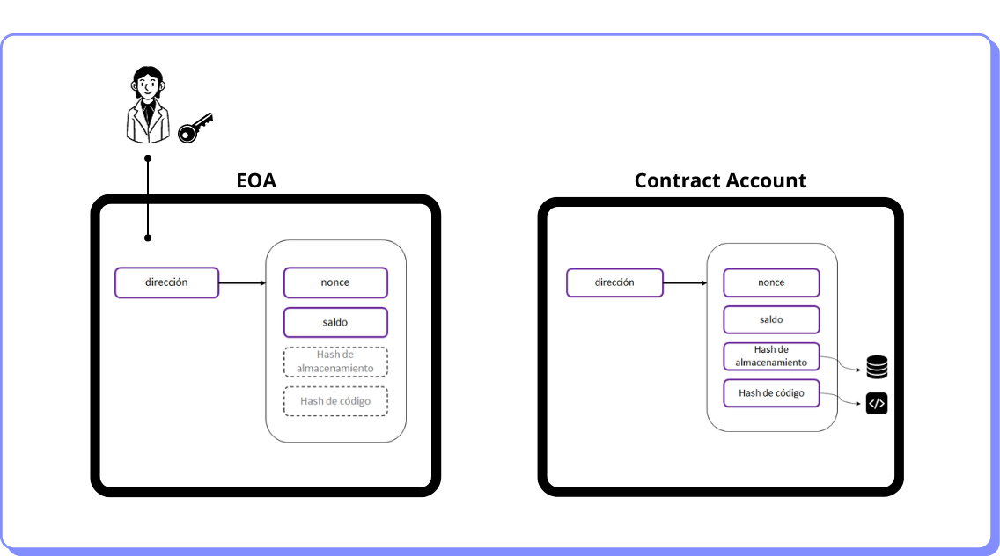

# Contenido de cuentas

En el gráfico siguiente podemos comparar el contenido de una EOA y una contract account. Si bien una EOA tiene cuatro campos para almacenar información, no utiliza los campos de almacenamiento ni código puesto que estos sólo se habilitan para las cuentas de smart contracts.

<figure><figcaption></figcaption></figure>

Los campos son los siguientes:

* **Nonce:** Para una EOA representa la cantidad de transacciones enviadas desde la cuenta. Para una contract account, la cantidad de contratos creados. Cada transacción debe tener un nonce único, y el nonce se incrementa en uno con cada nueva transacción enviada desde la cuenta. Esto ayuda a prevenir _replay attacks_ y garantiza que las transacciones se procesen en el orden correcto.
* **Saldo:** La cantidad de ETH que tiene la cuenta.
* **Hash de almacenamiento:** La raíz de un árbol Merkle-Patricia del contenido del almacenamiento del contrato. Los datos del contrato protegidos y comprimidos por criptografía.
* **Hash de código:** El código ejecutable asociado, en forma de hash. No se puede modificar.
