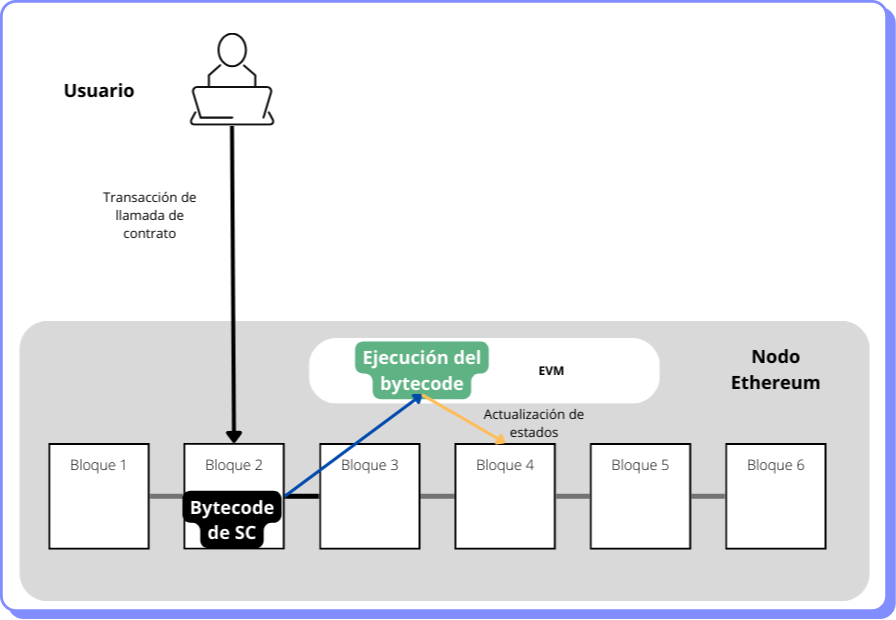
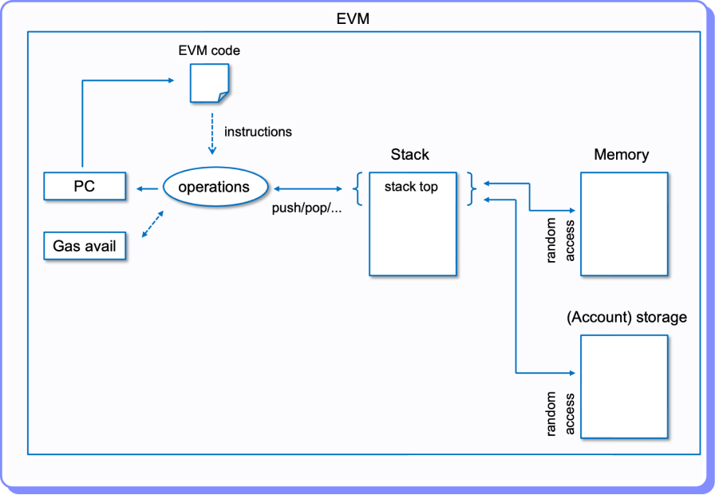

# Cómo funciona la EVM

De una forma simplificada, cuando un usuario quiere ejecutar una función de un smart contract, envía una transacción hacia la dirección o cuenta del smart contract. La EVM toma el bytecode, lo descompone en opcodes, los ejecuta y actualiza el nuevo estado en la blockchain. Tal como se muestra en el gráfico siguiente.

<figure><figcaption></figcaption></figure>

Para ver la ejecución con mayor detalle veamos cuáles son los componentes que tiene la EVM.

**El código** El código es el lugar donde se almacena el contrato inteligente. Los datos de programa almacenados en el código son persistentes como parte de un campo de estado de una contract account. El código es el bytecode interpretado y ejecutado por la EVM durante la ejecución del contrato inteligente. El código es inmutable, lo que significa que no se puede modificar, pero se puede leer con las instrucciones CODESIZE y CODECOPY. El código de un contrato puede ser leído por otros contratos, con instrucciones EXTCODESIZE y EXTCODECOPY.

**El Contador de Programa (PC)** El Contador de Programa codifica qué instrucción, almacenada en el bytecode, debe ser leída a continuación por la EVM. El PC normalmente se incrementa en un byte para apuntar a la siguiente instrucción, con algunas excepciones. Por ejemplo, la instrucción PUSHx tiene más de un byte y hace que la PC omita su parámetro. La instrucción JUMP no aumenta el valor de la PC, sino que modifica el contador del programa a una posición especificada en la parte superior de la pila. JUMPI también hace esto, si su condición es verdadera (un valor de código distinto de cero); de lo contrario, incrementa la PC como otras instrucciones.

**La pila o stack** El stack es una lista de elementos de 32 bytes que se utilizan para almacenar entradas y salidas de instrucciones de contratos inteligentes. Se crea una pila por contexto de llamada y se destruye cuando finaliza el contexto de llamada. Cuando se coloca un nuevo valor en la pila, se coloca en la parte superior y las instrucciones solo utilizan los valores superiores. La pila actualmente tiene un límite máximo de 1024 valores. Todas las instrucciones interactúan con la pila, pero se puede manipular directamente con instrucciones como PUSH1, POP, DUP1 o SWAP1.

**La memoria** La memoria EVM no es persistente y se destruye al final del contexto de llamada. Al comienzo de un contexto de llamada, la memoria se inicializa a 0. La lectura y escritura de la memoria generalmente se realiza con las instrucciones MLOAD y MSTORE respectivamente, pero también se puede acceder a ellas mediante otras instrucciones como CREATE o EXTCODECOPY.

**El almacenamiento o storage** El almacenamiento es una correspondencia o mapa de slots de 32 bytes a valores de 32 bytes. El almacenamiento es la memoria persistente de los contratos inteligentes: cada valor escrito por el contrato se retiene después de completar una llamada, a menos que su valor se cambie a 0 o se ejecute la instrucción SELFDESTRUCT. La lectura de bytes almacenados de una clave no escrita también devuelve 0. Cada contrato tiene su propio almacenamiento y no puede leer ni modificar el almacenamiento de otro contrato. El almacenamiento se lee y escribe con instrucciones SLOAD y SSTORE.

En el gráfico siguiente se visualiza cómo interactúan estos componentes. Ante una llamada a un smart contract se ejecutan los siguientes pasos:

1. Se identifica el código a ejecutar.
2. Mientras haya gas disponible, el contador de programa (PC) va incorporando una a una las instrucciones que se traducen en opcodes y se ejecutan en la pila (stack), que se apoya en la memoria (temporal) o en el storage (persistente), para almacenar y recuperar datos asociados a la ejecución.
3. Si el gas no se agotó antes de terminar la ejecución, se ha generado un nuevo estado para la blockchain. De lo contrario, el estado se revierte a la situación anterior a la ejecución de la transacción. El gas consumido no se recupera.

<figure><figcaption></figcaption></figure>
