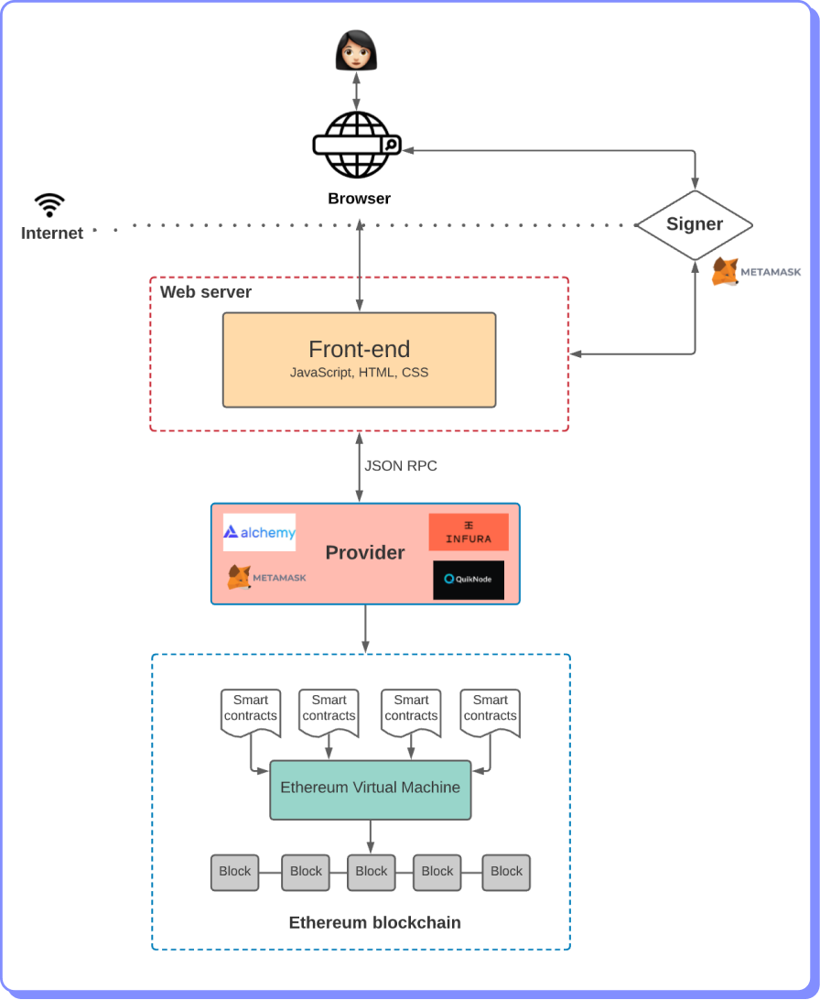

# DApps

Las Dapps (Decentralized Applications) son aplicaciones descentralizadas y son la forma en que normalmente interactúan los usuarios con los smart contracts de una blockchain como Ethereum.

Las dApps proveen una interfaz amigable, detrás de la cual orquestan la ejecución de los diferentes smart contracts que requieren para proveer su servicio. Una página donde se puede hacer seguimiento a las principales Dapps que existen en la actualidad es [DappRadar](https://dappradar.com/).

Existen miles de dApps disponibles en diversas categorías como redes sociales, subastas, juegos, seguros, exchanges, etc.

La arquitectura de una Dapp se muestra a continuación.

<figure><figcaption></figcaption></figure>
