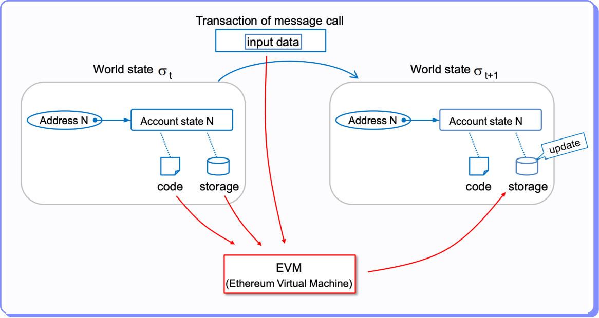

# La máquina de estados

Ethereum es una máquina de estados y la EVM es el procesador de transacciones que permite los cambios de estados.

El estado es una instantánea de la información que se almacena en la blockchain en un momento determinado.

El estado de una blockhain incluye:

* Los saldos de las cuentas: El saldo de una cuenta es la cantidad de ETH que posee la cuenta.
* Los contratos inteligentes: El estado almacena los contratos inteligentes que se han creado en Ethereum.
* Los datos asociados a los contratos: Por ejemplo quien posee determinado NFT o cuántos tokens ERC 20 tiene una determinada EOA.

Luego de la ejecución de una transacción por la EVM, el estado se actualiza para reflejar los resultados de esa ejecución.

<figure><figcaption></figcaption></figure>
