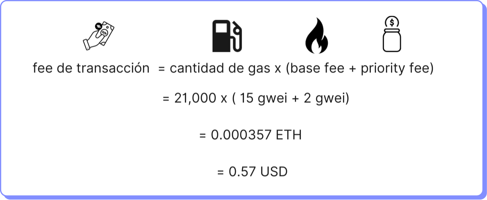
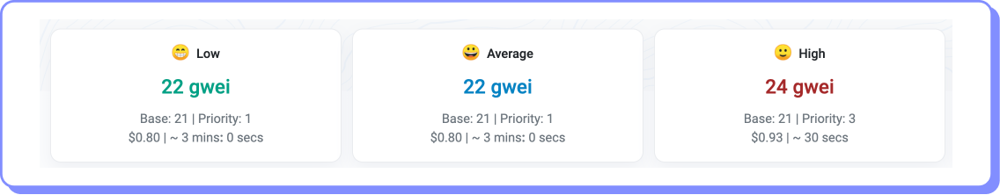

# Gas

En la criptoeconomía de Ethereum, gas es el combustible necesario para ejecutar los smart contracts. Es la unidad de medida del poder computacional requerido para ejecutar transacciones.

Una transacción puede comprender muchas instrucciones de máquina. Cada instrucción tiene un costo denominado en gas que tiene un costo preestablecido en el [Yellow Paper de Ethereum](https://ethereum.github.io/yellowpaper/paper.pdf) (apéndice G). Así por ejemplo, una instrucción de tipo suma (ADD) cuesta 3 gas, pero una más compleja como chequear un balance cuesta 700 gas.

El uso de gas también sirve para evitar que los usuarios corran programas que saturen los recursos de la red o que incurran en prácticas de programación ineficientes. Un loop erróneo, por ejemplo, sólo se ejecutará hasta que se le acabe el gas.

Para determinar el fee de un transacción tenemos dos componentes:

1. **Cantidad de gas.** Corresponde a las unidades de gas en función de las operaciones que una transacción consume. No es lo mismo hacer una transferencia de ETH, editar un campo de datos o almacenar un byte de datos. Cada una de estas transacciones consume una cantidad de gas diferente.

| Transacción          | Gas    |
| -------------------- | ------ |
| Transferencia de ETH | 21,000 |
| Editar un slot       | 5,000  |
| Byte de datos        | 16     |

2. **Precio del gas.** Tiene dos componentes: base fee y priority fee. El precio del gas se expresa en una fracción de ETH denominada gwei, que es equivalente a un mil millonésimo de esa moneda (1gwei = 10^-9 ETH).

#### **Base fee**

O tarifa base, se determina de forma automática por el protocolo en función de la demanda de transacciones. Si los bloques se llenan por encima valor objetivo (15 millones de gas), la base fee se incrementa automáticamente. Lo opuesto ocurre cuando los bloques se llenan por debajo del valor objetivo.

A partir de la actualización EIP 1559 (London) en el año 2021, este componente del gas se quema.

#### **Priority fee**

Es el importe que se paga por encima del base fee como una propina para el validador que genera el bloque. En función de este importe los validadores priorizan la inclusión de las transacciones en los bloques.

Según el fee que hayamos incluido nuestra transacción se ejecutará más pronto o más tarde, porque los validadores seleccionarán con preferencia del pool de transacciones que tienen para procesar a aquellas que tengan el precio de gas más alto. Por lo tanto, si tenemos urgencia en que nuestra transacción se ejecute tendremos que proponer un precio de gas más alto que el promedio del momento.

Supongamos que queremos ejecutar una transacción de 21000 gas, como una transferencia de ETH. Si la base fee es 15 gwei y estamos dispuestos a pagar una priority fee de 2 gwei.

El cálculo del fee a pagar por esta transacción, asumiendo que el precio del ETH es US$ 1600, se muestra en el siguiente gráfico:

<figure><figcaption></figcaption></figure>

### Límite de gas

Si bien la transacción de nuestro ejemplo requería 21,000 unidades de gas, lo normal es que se define un número más alto, denominado «límite de gas» que expresa lo máximo que estamos dispuestos a considerar por transacción, dado que podríamos haber cometido un error y la transacción requiera más de 21,000 gas. Si nuestro estimado se quedara corto, la transacción no terminaría de ejecutarse y perderíamos nuestro dinero. Por otro lado, si la necesidad de gas fuera menor se nos devolvería el gas no consumido. El límite de gas o “gas limit” es normalmente estimado por nuestra wallet en función de las operaciones que la transacción que estamos enviando va a ejecutar, por lo que se recomienda no modificar este dato.

### Dónde visualizar el precio del gas

En sitios como [EtherScan](https://etherscan.io/gastracker) y [Ultra sound money](https://ultrasound.money/) se puede monitorear los precios promedios de mercado de gas. Ten en cuenta que el precio del gas puede variar mucho de un momento a otro, variaciones de 500% o más en pocos minutos no son raras, es importante monitorearlo para no pagar demasiado por una transacción.

<figure><figcaption></figcaption></figure>
