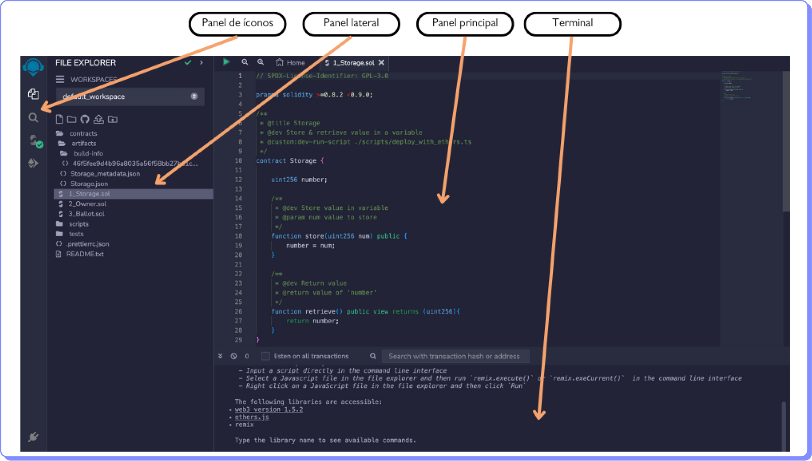
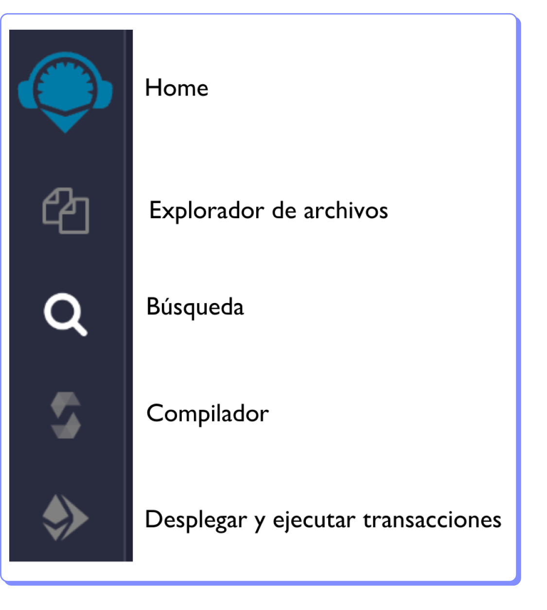

# Características de Remix

Remix ofrece una amplia gama de características, que incluyen:

* **Editor de código.** Remix incluye un editor de código completo que admite la sintaxis de Solidity, el lenguaje de programación para contratos inteligentes de Ethereum.
* **Integración con Solidity Compiler.** Remix está integrado con el compilador de Solidity, lo que permite a los desarrolladores compilar sus contratos inteligentes directamente desde el IDE.
* **Integración con Ethereum Wallets.** Remix se integra con una variedad de carteras Ethereum, lo que permite a los desarrolladores enviar y recibir ETH y tokens ERC-20.
* **Emulador de Ethereum.** Remix incluye un emulador de Ethereum que permite a los desarrolladores probar sus contratos inteligentes sin tener que desplegarlos en la cadena de bloques.
* **Debugger.** Remix incluye un depurador que permite a los desarrolladores depurar sus contratos inteligentes paso a paso.

Remix tiene cuatro paneles:

<figure><figcaption></figcaption></figure>

* La mayoría de plugins (complementos) aparecen en el panel lateral al ejecutarse.
* La edición de código se hace en el panel principal.
* Los resultados de las transacciones y otras acciones se muestran en el terminal.
* El salto de un plugin a otro se hace en el panel de íconos.

En el panel principal, si haces clic en el botón **Home** puedes acceder a los plugins destacados, plantillas, tutoriales y otra información útil.

<figure><figcaption></figcaption></figure>

Puedes acceder a la lista completa de plugins a través del botón Plugin Manager ubicado en la parte inferior del panel de íconos.

<figure><figcaption></figcaption></figure>

En la parte superior del panel de íconos encontrarás los siguientes botones por defecto.

<figure><figcaption></figcaption></figure>
