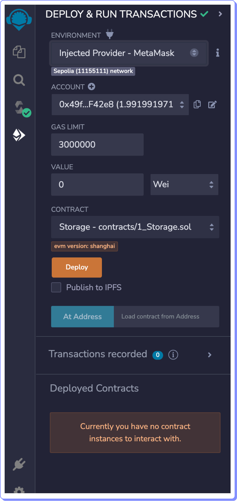
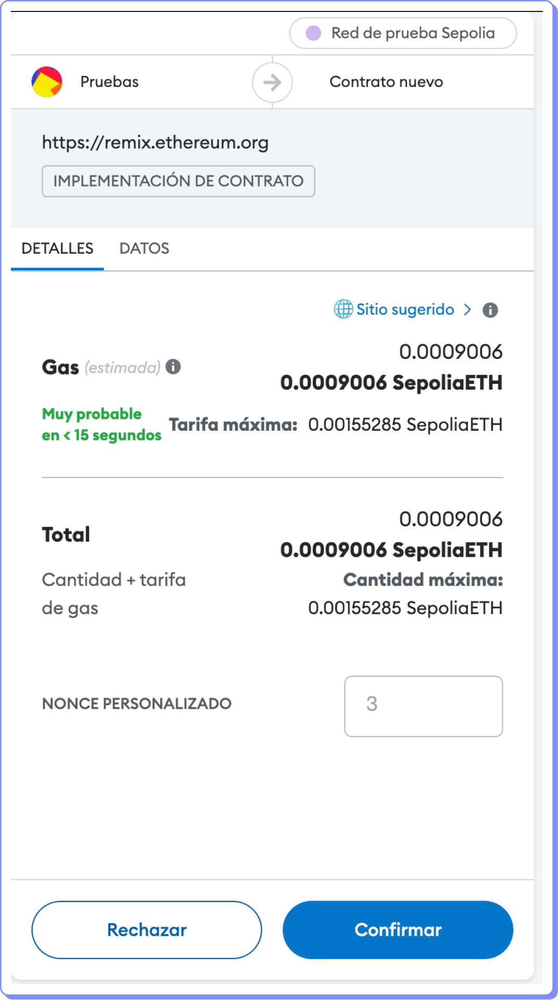
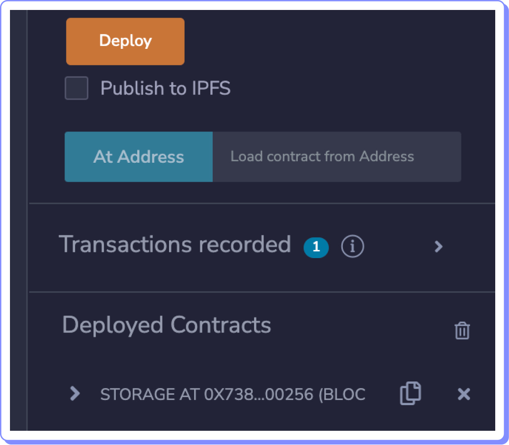
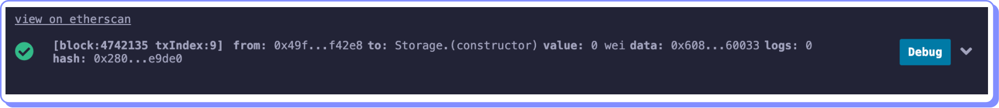

# Desplegar en una red pública

Para hacer el despliegue sobre una red pública, ya se mainnet o una testnet como Sepolia, es necesario contar con una wallet como Metamask con ETH suficiente para pagar el gas de la transacción.

Debes conectar tu wallet a la red en la que quieres hacer el despliegue del contrato.

Luego debes proceder de forma similar a el despliegue que hicimos sobre Remix VM, solo que ahora habrá que seleccionar un ENVIRONMENT diferente. En nuestro caso seleccionamos: Injected Provider - Metamask. Nuesta wallet está conectada a la red de prueba Sepolia y tiene fondos suficientes para ejecutar la transacción de despliegue.

<figure><figcaption></figcaption></figure>

Verificamos que el contrato es el correcto y hacemos clic sobre Deploy.

Esta vez sí requerimos firmar la transacción para aprobar el consumo de gas.

<figure><figcaption></figcaption></figure>

Damos a Confirmar y la transacción de creación será enviada.

Unos segundos después podremos ver creado nuestro contrato en la sección Deployed Contracts.

<figure><figcaption></figcaption></figure>

En el terminal veremos datos de la transacción ejecutada.

<figure><figcaption></figcaption></figure>

Ahora podemos interactuar con las funciones del contrato de la misma forma que lo hicimos en Remix VM. Solo que esta vez tendremos que aprobar la transacción de escritura y pagar el gas necesario para ejecutarla, utilizando nuestra wallet.
