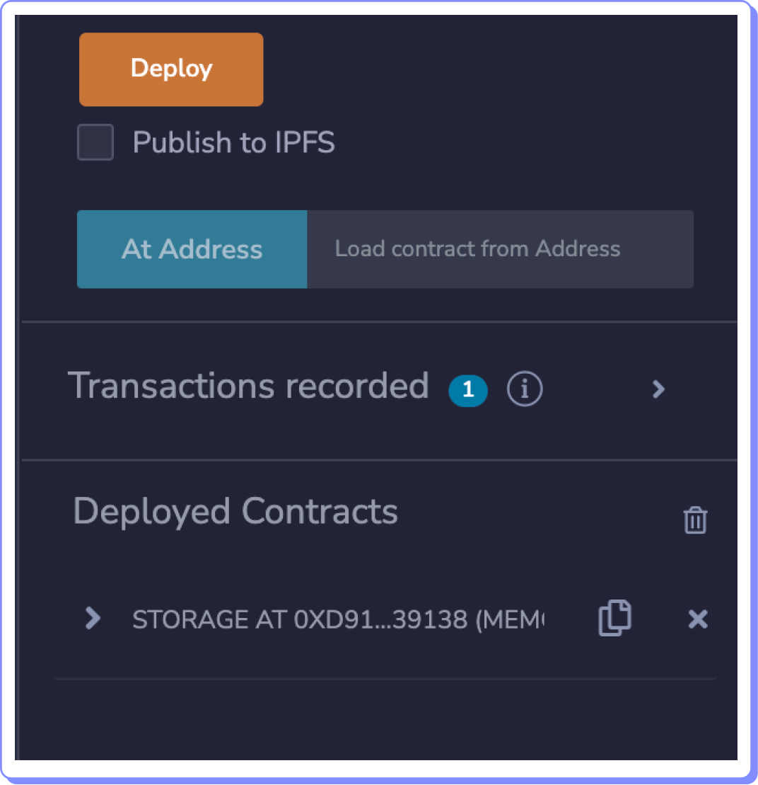
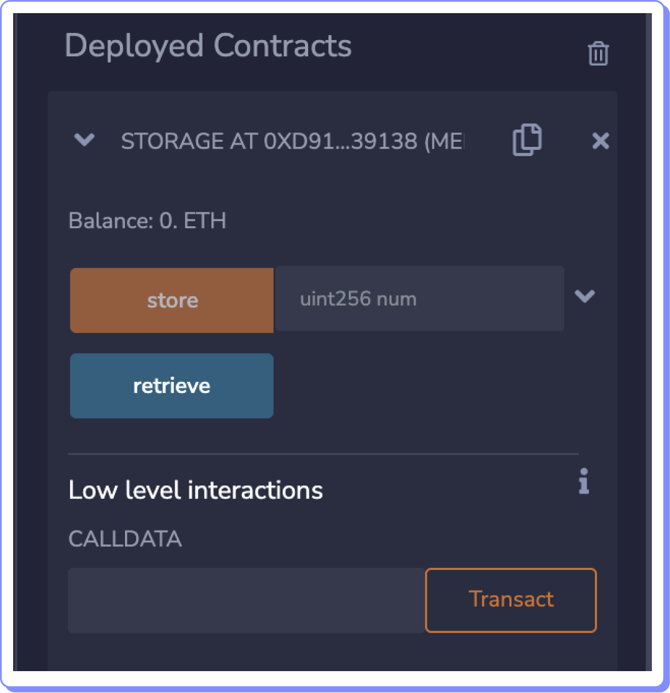

# Interactuando con funciones

Ahora accederemos a las funciones de un contrato desplegado. Puedes observar que luego de haber desplegado el contrato aparece en la parte inferior del panel lateral un contrato desplegado en la sección Deployed Contracts.

<figure><figcaption></figcaption></figure>

Selecciónalo y te aparecerán las funciones habilitadas en el contrato desplegado.

<figure><figcaption></figcaption></figure>

Una función aparece en color naranja y te permite ingresar un campo de datos de tipo número. Es una función pública (accesible por cualquiera) y que puede modificar datos de la blockchain, por lo tanto tendrá un costo de gas.

La otra función aparece en azul y es una función de solo lectura que no consumirá gas.

Para ejecutar la función de escritura (naranja) se debe ingresar un dato numérico y hacer click sobre el botón.

En el caso de la función de lectura sólo hace falta hacer clic sobre el botón.

Si el contrato se ha desplegado sobre Remix VM no será necesario aprobar ninguna de estas transacciones.
