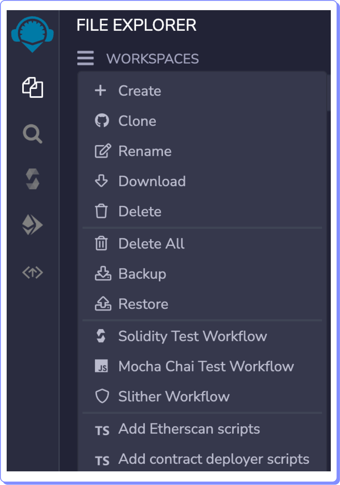

# Workspaces o espacios de trabajo

Los espacios de trabajo te permiten separar tus proyectos. Puedes guardar muchos contratos inteligentes y la información asociada a ellos en un mismo espacio de trabajo.

Para crear un espacio de trabajo, haz clic en el explorador de archivos del panel de íconos, luego selecciona el menú hamburguesa y selecciona la opción Create.

<figure><figcaption></figcaption></figure>

Observa que no sólo puedes crear espacios de trabajo, sino que tienes muchas opciones más.
