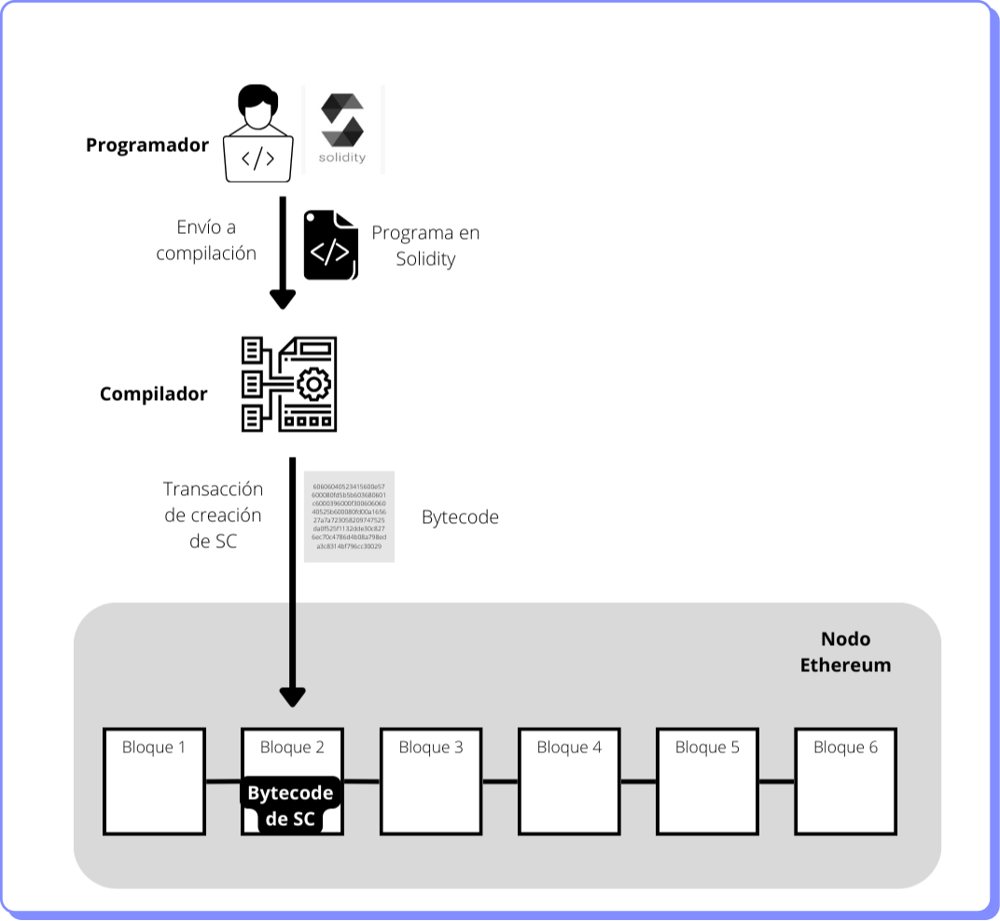

# Solidity

Si bien existen diversos lenguajes de programación para crear contratos inteligentes en Ethereum, el más difundido se llama Solidity, que es muy similar a JavaScript o C++.

A diferencia de Bitcoin Script, Solidity es un lenguaje Turing-complete, es decir que se puede programar lo que uno quiera con él.

Sin embargo la EVM no entiende Solidity sino Bytecode. Por ello, antes de enviar un smart contract o programa a la EVM el código creado en Solidity debe pasar por un compilador que lo convierte en Bytecode.

El código en Bytecode se carga en una transacción de creación de contrato para quedar registrado en la blockchain como una cuenta de contrato.

<figure><figcaption></figcaption></figure>

En el proceso de compilación hay otro resultado adicional aparte del bytecode. Es la ABI o Application Binary Interface que es un archivo en formato JSON que contiene todos los métodos y sus respectivos parámetros que tiene el contrato inteligente. La comunicación con el contrato inteligente se realiza a través de esta ABI. Sería el equivalente a un API en el mundo Web2. Todo lo que se programa en Ethereum es de código abierto. Esto quiere decir que cualquiera puede descargar ese código para luego modificarlo y crear una nueva aplicación.

Si estás interesado en aprender a programar en Solidity hay muchas fuentes. El sitio oficial de [Solidity](https://docs.soliditylang.org/) es una buena referencia. También encontrarás en el [Módulo 2](../../../modulo-2/fundamentos-de-solidity/) ejercicios y conceptos en el curso del Ethereum Developer Pack.
