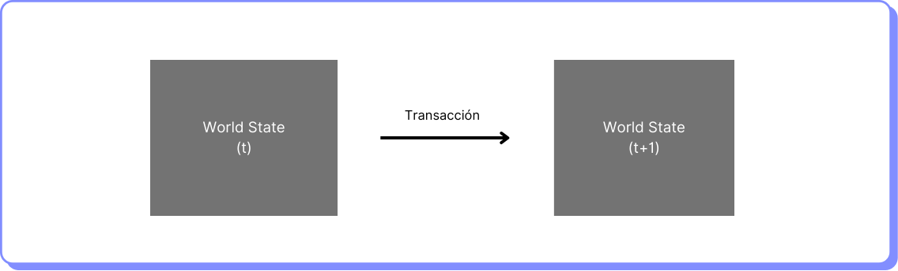

# Transacciones

Las transacciones son acciones iniciadas por una EOA, es decir por una cuenta manejada por un humano, no por un smart contract. Una transacción sería por ejemplo enviar 10 ETH de A a B.

Las transacciones cambian el estado de computadora mundial descentralizada a la que se conoce también como una máquina de estados.

<figure><figcaption></figcaption></figure>

Las transacciones para ser procesadas por la EVM deben ser enviadas a los nodos de la red de Ethereum.

Se dice que las transacciones en Ethereum son atómicas porque son indivisibles. Esto significa que una transacción, o bien se ejecuta por completo, o bien no se ejecuta en absoluto.

#### Tipos de transacciones

Las transacciones más comunes son las siguientes:

* **Transacciones regulares.** Una transferencia de ETH desde una cuenta a otra.
* **Transacción de despliegue de contrato.** Una transacción para crear un contrato inteligente. No tiene dirección de destino (to) y carga el código del smart contract en el campo input.
* **Transacción de ejecución de contrato.** Una transacción que interactúa con un contrato inteligente desplegado. En este caso, la dirección de destino (to) es la dirección del contrato inteligente.
