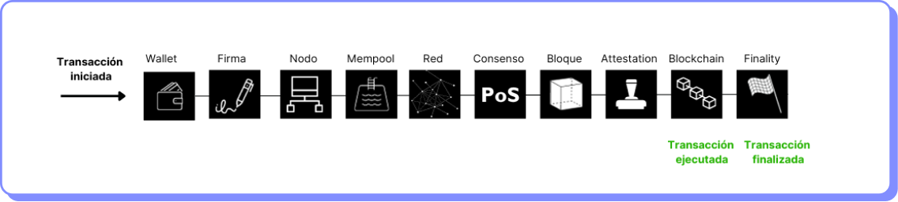
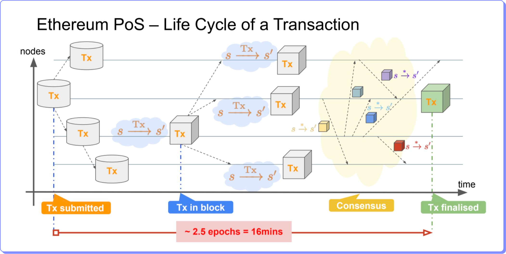

# Ciclo de vida

<figure><figcaption></figcaption></figure>

**Paso 1**

La transacción es creada y firmada utilizando normalmente una wallet.

Se obtiene el hash de la transacción y se envía a un nodo de Ethereum, donde será recibida por el cliente de ejecución.

El cliente de ejecución verifica si existe suficiente saldo para procesar la transacción y verifica si la firma es válida.

Una vez aprobada añade la transacción a su mempool local.

Luego transmite la transacción a los nodos conectados de la red.

Los otros nodos reciben la transacción y la añaden a sus mempools locales.

**Paso 2**

Utilizando el protocolo de consenso Proof of Stake, un nodo es seleccionado aleatoriamente para proponer un bloque, para ello seleccionará transacciones de la mempool.

El nodo envía el bloque creado a la red.

**Paso 3**

Se selecciona un grupo de nodos de forma aleatoria que tendrán el rol de testigos (attesters).

Estos nodos vuelven a realizar la creación del bloque localmente para asegurar de que el bloque propuesto es legítimo.

Si el bloque es válido, es añadido a la blockchain local de los nodos.

**Paso 4**

El bloque se añade a la cadena de Ethereum luego de un proceso denominado Finalidad (Finality).

Si 2/3 de los ETH en stake votan a favor de un bloque este pasa a estado “justificado”.

Cuando otro bloque justificado se añade sobre el bloque justificado anterior, el bloque pasa a ser “finalizado”.

De esta manera el bloque final es producido y la transacción queda registrada para siempre.

<figure><figcaption></figcaption></figure>
