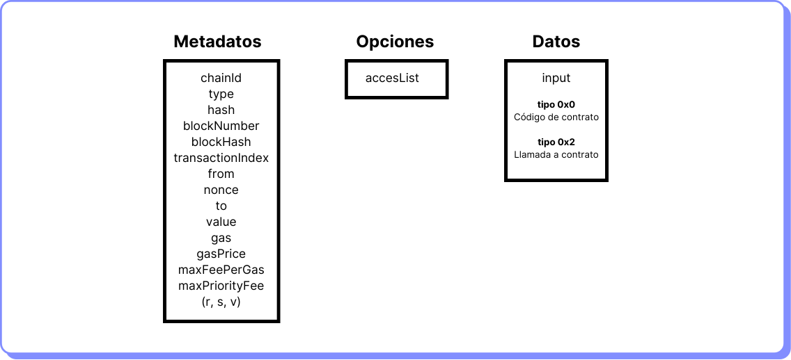
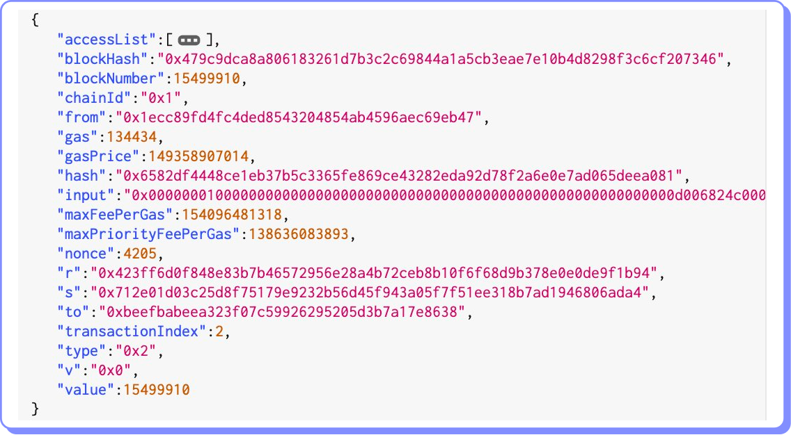

# Componentes

Una transacción de Ethereum tiene los siguientes componentes:

<figure><figcaption></figcaption></figure>

#### **Metadatos**

Incluye la información de origen y destino, el importe de ETH a enviar, detalles del gas y la firma:

* **chainId:** identifica a la blockchain. 0x1 para Ethereum.
* **type:** tipo de transacción. Hay dos tipos: nuevo contrato (0x0) y todas las demás (0x2).
* **hash:** hash de la transacción.
* **blockNumber:** el número secuencial que identifica al bloque dentro de la blockchain.
* **blockHash:** el hash del bloque que contiene la transacción.
* **transactionIndex:** posición de la transacción dentro del bloque.
* **from:** dirección que inicia la transacción.
* **nonce:** número de transacciones enviadas desde la dirección que envía la transacción. Una vez que la transacción ha sido incluida en el bloque, el nonce se incrementa. Protege de ataques de replay.
* **to:** dirección a la que se envía la transacción (EOA o cuenta de contrato).
* **value:** importe de ETH a transferir. No se utiliza para otra criptomoneda.
* **gas:** unidades de gas utilizadas por la transacción.
* **gasPrice:** importe pagado en esta transacción por unidad de gas (en wei).
* **maxFeePerGas:** importe máximo dispuesto a pagar por gas (en wei) por el usuario que envía la transacción. Incluye base fee y priority fee.
* **maxPriorityFeePerGas:** importe máximo dispuesto a pagar por gas por el el usuario que envía la transacción (en wei) por encima de la base fee. Este fee se paga directamente al validador para que priorice la inclusión de la transacción en el bloque.
* **(r, s, v)** estos tres valores conforman la firma del usuario que creó la transacción. Se usan para verificar que el usuario autorizó la transacción antes de que sea ejecutada por la EVM. Se usa criptografía de curvas elípticas (ECDSA).

#### **Opciones**

Contiene:

* **accessList:** una lista de direcciones y claves de almacenamiento que la transacción tiene previsto acceder. El access list se introdujo con la propuesta de mejora [EIP-2930](https://eips.ethereum.org/EIPS/eip-2930), que tiene como objetivo mejorar la escalabilidad y reducir los costes de gas de las transacciones que acceden a almacenamiento externo. El costo de gas por acceder estas direcciones tiene un descuento.

#### **Datos**

Contiene:

* **input:** los datos enviados por la transacción en formato binario. .

Existen tres opciones para lo que contiene el input:

1. Transacciones ETH - vacío.
2. Nuevo contrato inteligente - código del contrato inteligente.
3. Llamada a un contrato inteligente - nombre de la función y parámetros para su ejecución.

El campo “input” no es parte del estado de la EVM. Simplemente provee datos para ser utilizados por el contrato durante la transacción.

Así se vería una transacción completa:

<figure><figcaption></figcaption></figure>
