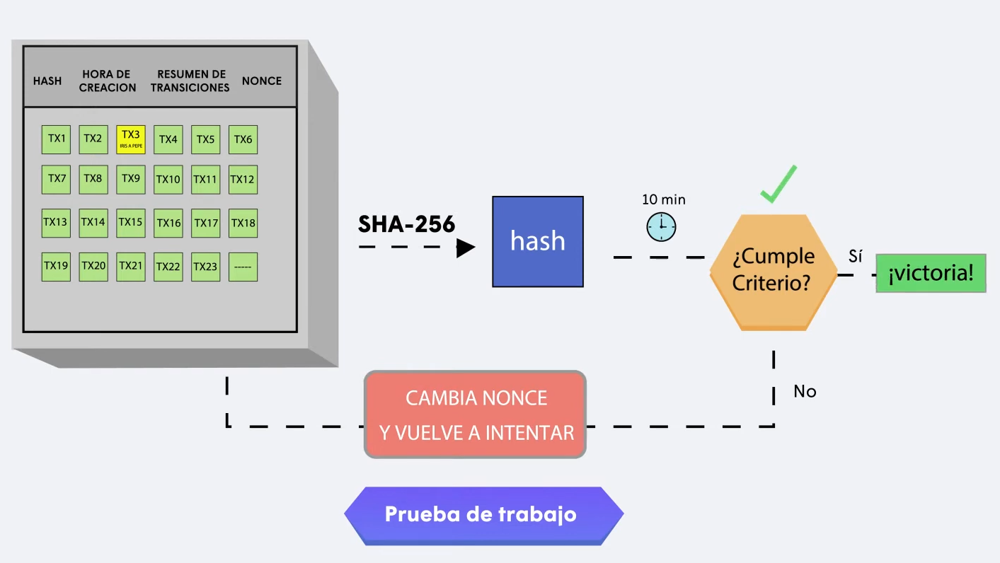
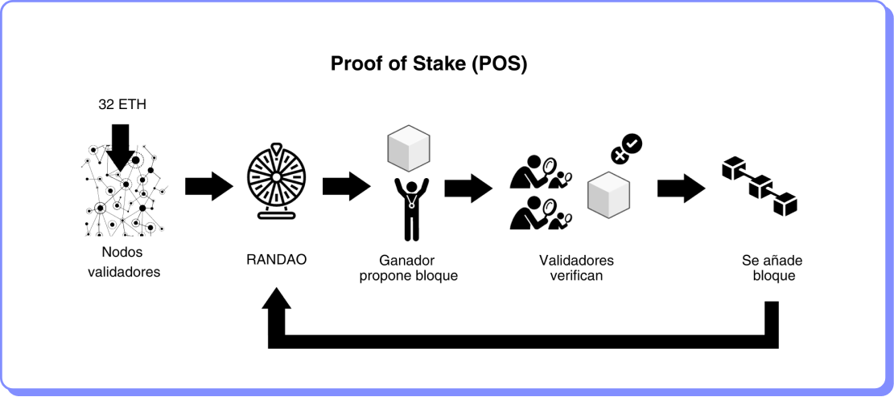

# Modelos de Consenso

Consenso es el acuerdo entre un grupo de participantes de un sistema distribuido respecto al estado del sistema. Cuando se alcanza el consenso, todo el sistema distribuido puede ser visto como una sola entidad. El sistema puede estar sujeto a fallas de algunos nodos o a ataques maliciosos. El consenso es llegar a un acuerdo bajo situaciones adversas.

En blockchain, el modelo de consenso se refiere al proceso mediante el cual se toman decisiones sobre qué transacciones se agregan a la cadena de bloques y cómo se hacen. Hay varios modelos de consenso diferentes, y cada uno tiene sus propias ventajas y desventajas.

Los modelos de consenso más conocidos son:

*   **Prueba de trabajo (PoW):** Este modelo de consenso es utilizado por Bitcoin y otras criptomonedas. Los nodos de la red compiten para resolver problemas matemáticos complejos, y el primero en hacerlo recibe una recompensa en forma de criptomonedas. Este modelo es muy seguro, pero también es muy exigente en términos de energía y recursos.

    El modelo de consenso de PoW se denomina consenso de Nakamoto que tiene los siguientes atributos:

    * Cualquier nodo se puede unir o abandonar la red en cualquier momento.
    * Cualquier puede enviar mensajes corruptos a los demás.
    * Cualquier usuario puede utilizar tantas identidad como quiera.
    * Para prevenir que obtenga alguna ventaja alguien que crea múltiples identidades de forma deshonesta, el poder de voto debe ser escaso, lo que se logra vinculando el poder de voto a un recurso escaso como energía o electricidad.

    PoW fue diseñado para abordar el problema de los generales bizantinos en una red descentralizada al hacer costoso y difícil manipular la red a los nodos malintencionados, lo que la hace muy segura.

<figure><figcaption></figcaption></figure>

PoW tiene algunas desventajas, como por ejemplo el alto consumo de energía y la centralización en manos de grandes pooles de minería.

*   **Prueba de participación (PoS):** Este modelo de consenso se basa en el “stake”, el importe de criptomonedas que los participantes ponen a disposición de la red, en lugar de en la potencia de procesamiento. Los nodos que tienen más criptomonedas tienen mayor probabilidad de ser elegidos para validar las transacciones. Este modelo es más eficiente energéticamente que PoW.

    PoS consume mucho menos energía, ya que no requiere la resolución de problemas matemáticos complejos y costosos, además de que facilita la escalabilidad y el tiempo de confirmación de una transacción es mucho más rápido comparado con PoW.

<figure><figcaption></figcaption></figure>

Previamente a entrar en el sorteo para elegir al validador, los participantes ponen a disposición de la red una cantidad determinada de criptomonedas como garantía.

1. El siguiente validador o creador de bloque se selecciona aleatoriamente.
2. El validador crea y propaga el siguiente bloque en la cadena.
3. Otros validadores verifican la integridad del bloque y las transacciones.
4. Los validadores reciben recompensas por comportarse correctamente y pueden ser penalizados por acciones maliciosas.
5. El proceso de selección y validación se repite continuamente.
