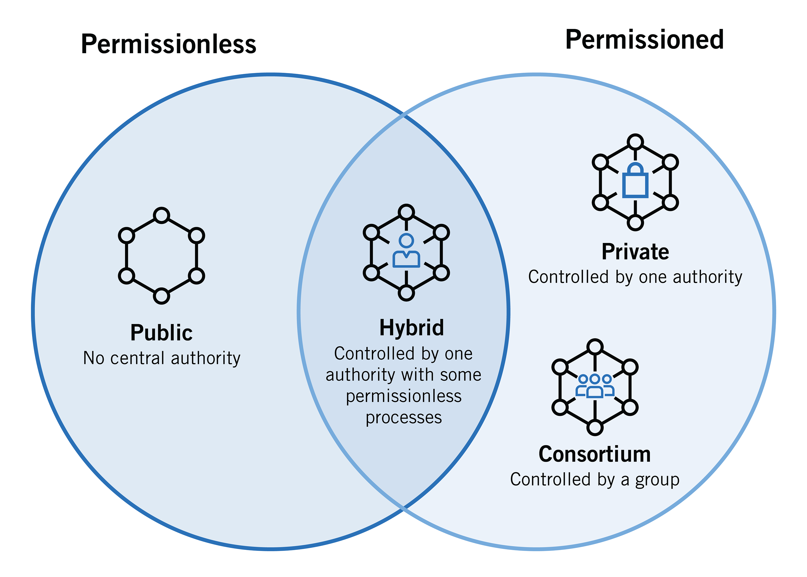

# Tipos de Blockchain

En términos generales, existen tres tipos de blockchains: privadas, públicas y híbridas.

Las blockchains privadas son redes controladas por una entidad centralizada y solo un grupo selecto de participantes tiene permiso para acceder y validar las transacciones.

Las blockchains públicas, en cambio, son redes descentralizadas y cualquier persona puede unirse, enviar transacciones y validarlas.

Las blockchains híbridas combinan características de las blockchains públicas y privadas, ofreciendo flexibilidad y ajustabilidad según las necesidades de los usuarios.

Cada tipo de blockchain tiene sus propias ventajas y desventajas, y la elección de una u otra dependerá de las necesidades específicas del usuario o de la organización que utiliza la red.

<figure><figcaption></figcaption></figure>

|           | Privada                                             | Pública                                                     | Hibrida                                     |
| --------- | --------------------------------------------------- | ----------------------------------------------------------- | ------------------------------------------- |
| Propósito | Uso interno de una organización o grupo de empresas | Uso público y descentralizado en todo el mundo              | Combinación de blockchain privado y público |
| Velocidad | Muy rápido por limitación de nodos                  | Más lento, requiere validaciones                            | Varía según el diseño de la red             |
| Seguridad | Alta, porque está limitado a ciertos usuarios       | Alta debido a la descentralización y la validación de nodos | Varía según el diseño de la red             |
| Costo     | Menos costoso por nodos limitados                   | Más costoso debido a mayor cantidad de nodos                | Varía según el diseño de la red             |
