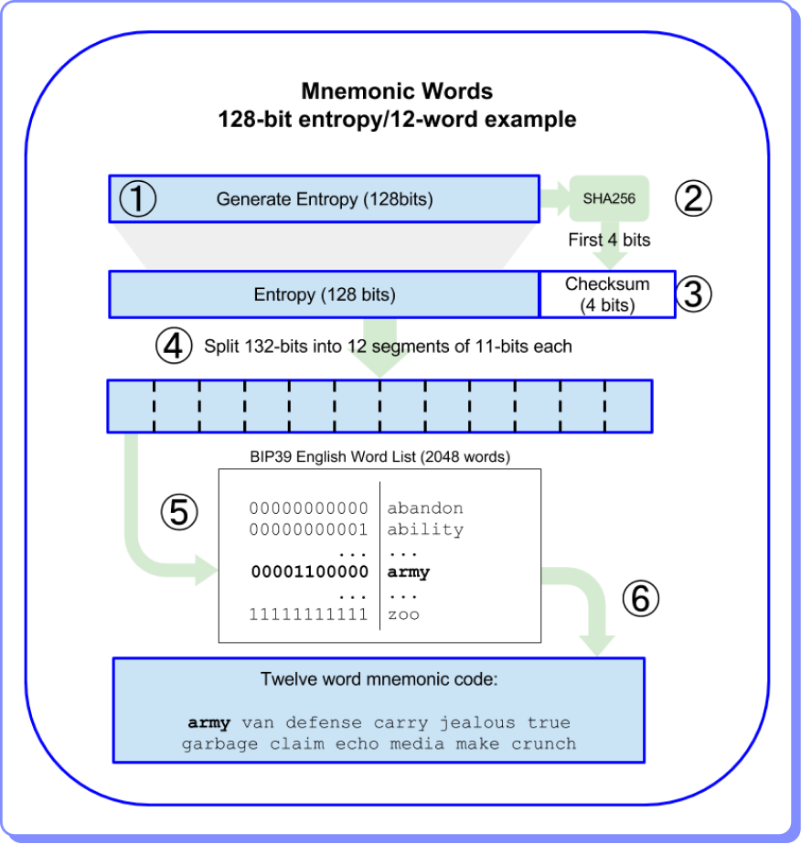

# Códigos mnemónicos

Los códigos mnemónicos, a menudo llamados frases de recuperación o seed phrases, son secuencias de palabras fáciles de recordar que actúan como representaciones humanas de información criptográfica más compleja. Aunque parecen meras palabras, estas frases encierran el acceso a carteras de criptomonedas, activos digitales y datos sensibles. La simplicidad aparente de las palabras oculta la complejidad matemática y criptográfica que las respalda.

Uno de los estándares más conocidos de generación de códigos mnemónicos es el BIP39, propuesto por el equipo de Bitcoin en 2013. BIP39 (Bitcoin Improvement Proposal 39) establece las pautas para la generación de códigos mnemónicos y su conversión en semillas binarias utilizadas para derivar claves privadas y, en última instancia, para acceder a fondos de criptomonedas. Prueba cómo funciona el BIP39 [aquí](https://iancoleman.io/bip39/).

El estándar BIP39 especifica una estructura precisa para la creación de códigos mnemónicos. Comienza con la elección de una semilla de entropía, que puede generarse de manera aleatoria o derivarse de datos específicos. Esta semilla se somete a funciones criptográficas, como el hash SHA-256, y se divide en segmentos de bits que forman el código mnemónico.

El vocabulario BIP39 consta de una lista de palabras predefinidas, y cada palabra representa un grupo específico de bits de la semilla. El estándar utiliza una longitud de 12, 15, 18, 21 o 24 palabras, brindando opciones para diferentes niveles de seguridad y facilidad de uso.

<figure><figcaption></figcaption></figure>

La elección de una buena entropía es esencial para la seguridad de un código mnemónico. La entropía, en términos sencillos, es la medida de la imprevisibilidad. Una entropía adecuada garantiza que las claves generadas sean lo suficientemente complejas como para resistir ataques de fuerza bruta y garantiza la seguridad de los activos almacenados.

Una vez que se tiene un código mnemónico BIP39, el proceso de derivación jerárquica (HD, por sus siglas en inglés) es fundamental. HD BIP32 permite derivar una secuencia infinita de claves privadas a partir de una única semilla, lo que facilita la administración de múltiples direcciones y transacciones.

Cada palabra en el código mnemónico actúa como un índice en una jerarquía determinística, permitiendo la generación de claves privadas únicas y, por ende, la seguridad de los fondos asociados.

La implementación exitosa del estándar BIP39 llevó a la proliferación de HD wallets, carteras determinísticas jerárquicas que utilizan códigos mnemónicos para gestionar direcciones y transacciones de forma segura. Estas carteras han simplificado significativamente la experiencia de los usuarios al permitir la recuperación de carteras completas con solo la frase de recuperación.

A pesar de su utilidad, los códigos mnemónicos también presentan desafíos. La seguridad de estas frases recae en la responsabilidad del usuario para almacenarlas de manera segura. Factores como el riesgo de pérdida o robo físico del papel o dispositivo que almacena la frase de recuperación subrayan la necesidad de consideraciones adicionales en la gestión de estos códigos.

Además, la fragilidad humana puede llevar a la elección de frases mnemotécnicas débiles o predecibles, lo que pone en riesgo la seguridad de los fondos. La educación y la conciencia son, por lo tanto, cruciales en la gestión correcta de códigos mnemónicos.
