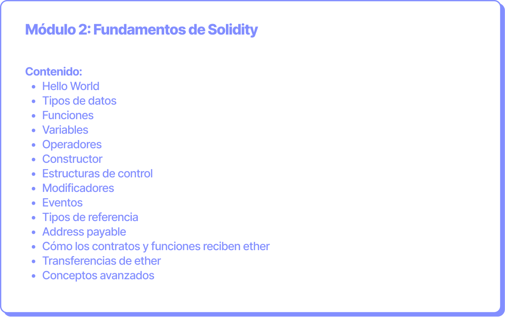

# Fundamentos de Solidity

**Objetivo:** Aprender el principal lenguaje para programar smart contracts: Solidity.&#x20;

**Duración:** 9 horas (3 clases de 3 horas cada una).

<figure><figcaption></figcaption></figure>
