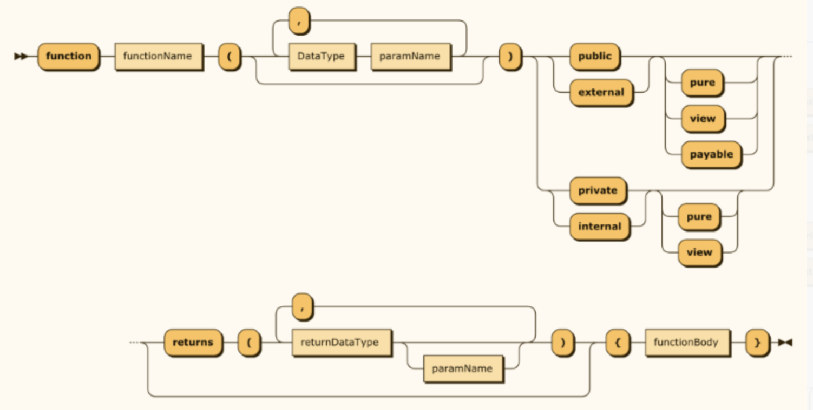

# Funciones

En Solidity, las funciones son las unidades ejecutables de código. Cada función es un procedimiento o método que puede ser llamado interna o externamente para realizar alguna tarea o calcular y devolver valores.

### Visibilidad de funciones

La visibilidad de una función indica desde donde puede ser llamada. Existen cuatro tipos de visibilidades.

* **Public**: Accesible desde dentro y fuera del contrato. Si no se especifica la visibilidad de una función, por defecto es **`public`**.
*   **External**: Solo accesible desde fuera del contrato. No pueden ser llamadas internamente (directamente) dentro del mismo contrato. Sin embargo, pueden ser invocadas internamente usando **`this.functionName()`**.

    Su uso correcto puede llevar a ahorros significativos de gas. Si sabemos que la función sólo será llamada desde fuera, es más eficiente utilizar **`external`**. Son ideales para funciones que deben ser expuestas como parte de la interfaz del contrato (ABI - Application Binary Interface).
* **Internal**: Accesible solo desde dentro del contrato y sus contratos derivados. Son útiles para compartir funcionalidades entre contratos en una jerarquía de herencia.
* **Private**: Solo accesible desde dentro del contrato en el que está definida. Son útiles para lógica interna que no se supone que sea accesible para otros contratos o entidades externas.

A continuación se muestra la forma en que se indica la visibilidad de las funciones en un contrato.

```solidity
contract MyContract {
uint private data;

function publicFunction() public {
    // accesible desde cualquier parte
}

function privateFunction() private {
    // solo accesible dentro de este contrato
}

function internalFunction() internal {
    // accesible dentro de este contrato y contratos heredados
}

function externalFunction() external {
    // solo accesible desde fuera del contrato
}

}
```

🚨 La elección adecuada de la visibilidad de las funciones es crucial para la seguridad y la optimización del gas. Por ejemplo, funciones que no necesitan ser expuestas deben marcarse como **`private`** o **`internal`**.

🚨 La visibilidad incorrecta puede llevar a vulnerabilidades. Por ejemplo, una función que modifica el estado del contrato y está marcada erróneamente como **`public`** puede ser explotada.

### Indicadores de mutabilidad o comportamiento

Sirven para indicar si la función hace cambios en el almacenamiento persistente (storage) del contrato, también indica si la función puede recibir Ether.

Se utilizan tres indicadores en este caso:

* **Pure**: Indica que la función no accede ni modifica el storage del contrato.
* **View**: Similar a **`pure`**, pero puede leer el storage del contrato sin modificarlo.
* **Payable**: Permite que la función reciba Ether junto con una llamada a la función.

### Estructura de una función en Solidity

Estos son los elementos que conforman una función:

* **Palabra Clave function:** Toda función comienza con la palabra clave **`function`**, indicando el inicio de una definición de función.
* **Nombre de la Función:** Seguido de **`function`**, se coloca el nombre de la función. Debe ser único dentro del contrato y seguir las convenciones de nomenclatura de Solidity (generalmente camelCase).
* **Parámetros (Opcionales):** Entre paréntesis, se definen los parámetros de entrada de la función, si los hay. Cada parámetro consta de un tipo de dato seguido de un nombre de variable. Los parámetros están separados por comas.
* **Visibilidad de la Función:** A continuación, se especifica la visibilidad de la función (**`public`**, **`private`**, **`internal`**, **`external`**). Esto determina cómo y desde dónde se puede acceder a la función.
* **Modificadores (Opcionales):** Los modificadores son palabras clave o nombres de modificadores personalizados que afectan el comportamiento de la función: .**`pure`,`view`,`payable`** .
* **Valores de Retorno (Opcionales):** Después de los modificadores, se puede especificar el tipo de valor o valores que la función devuelve, encerrado entre la palabra clave **`returns`** y paréntesis. Si se devuelven múltiples valores, se separan por comas.
* **Cuerpo de la Función:** El cuerpo de la función está encerrado entre llaves {}. Aquí es donde se escribe la lógica que se ejecutará cuando se llame a la función.

<div>


 

<figure><figcaption></figcaption></figure>

</div>

### Otros aspectos relevantes de las funciones

Las funciones **`payable`** son una característica única de Solidity que permite a los contratos recibir y manejar Ether, la criptomoneda nativa de Ethereum.

💡 Las funciones consumen gas, que es la unidad de medida para el costo computacional en Ethereum. El gas necesario depende de la complejidad de las operaciones realizadas por la función. Por ello es importante realizar una programación eficiente en consumo de gas.

🥸 Solidity soporta la sobrecarga de funciones (overload), lo que significa que puedes tener múltiples funciones con el mismo nombre pero con diferentes parámetros.

```solidity
contract ExampleContract {
    uint private counter;

    // Una función pública que incrementa el contador
    function incrementCounter() public {
        counter++;
    }

    // Una función de vista que devuelve el valor actual del contador
    function getCounter() public view returns (uint) {
        return counter;
    }
}
```

En este ejemplo, **`incrementCounter`** es una función pública que modifica el estado del contrato, y **`getCounter`** es una función de vista que simplemente devuelve el valor del contador sin modificar el estado del contrato.
