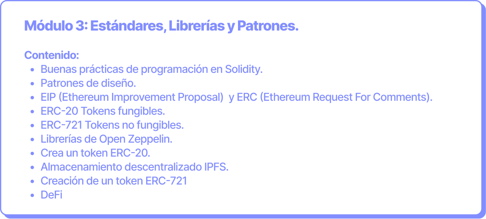

# Estándares, Librerías y Patrones

**Objetivo:** Profundizar en estándares como ERC-20, ERC-721 y otros. Conocer las principales librerías y buenas prácticas de diseño.

**Duración:** 9 horas (3 clases de 3 horas cada una).

<figure><figcaption></figcaption></figure>

Toda la información [aquí](https://ethkipu.notion.site/Est-ndares-librer-as-y-patrones-934170ce0a054c8b88d095b08a40df02).
