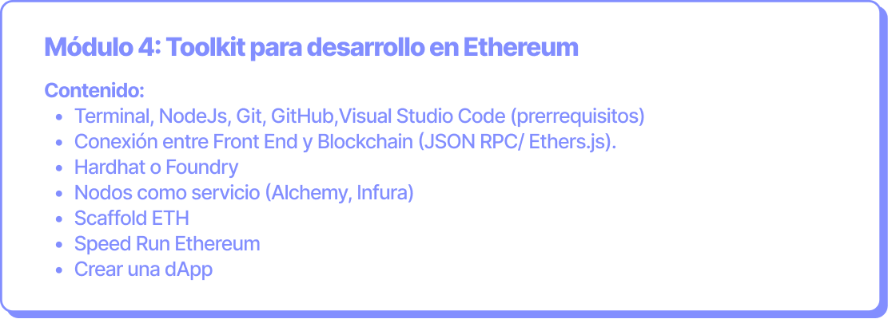

# Toolkit para desarrollo Ethereum

**Objetivo:** Conectar el frontend a la blockchain, utilizando las principales herramientas del mercado para desarrollar en Web3.

**Duración:** 9 horas (3 clases de 3 horas cada una).

<figure><figcaption></figcaption></figure>

Toda la información [aquí](https://ethkipu.notion.site/Material-de-preparaci-n-para-el-m-dulo-4-90ac193ca22a4d0a82d173cdd153b592?pvs=4).
