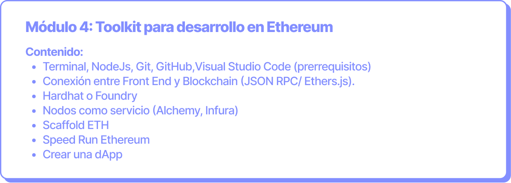

# Toolkit para desarrollo en Ethereum


Este documento es una herramienta pedagógica que actualizamos constantemente. Creemos en la importancia de contenidos open-source. Si quieres mejorar los contenidos, únete a nuestro de [Kipu Explorers](../../contribuye/kipu-explorer.md).


**Objetivo:** Conectar el frontend a la blockchain, utilizando las principales herramientas del mercado para desarrollar en Web3.

**Duración:** 9 horas (3 clases de 3 horas cada una).

<figure><figcaption></figcaption></figure>

Para poder participar en este módulo es necesario instalar y conocer las herramientas señaladas en la sección de requisitos del módulo 4.
