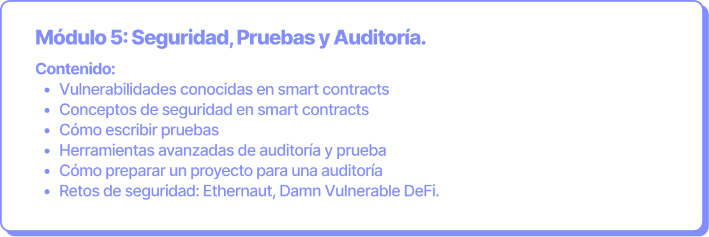

# Seguridad, Pruebas y Auditoría

**Objetivo:** Conocer metodologías para realizar pruebas, así como las principales vulnerabilidades en los smart contracts. Adicionalmente, aprender a prepararse para aprobar una auditoría de smart contracts.

**Duración:** 6 horas (2 clases de 3 horas cada una).

<figure><figcaption></figcaption></figure>
